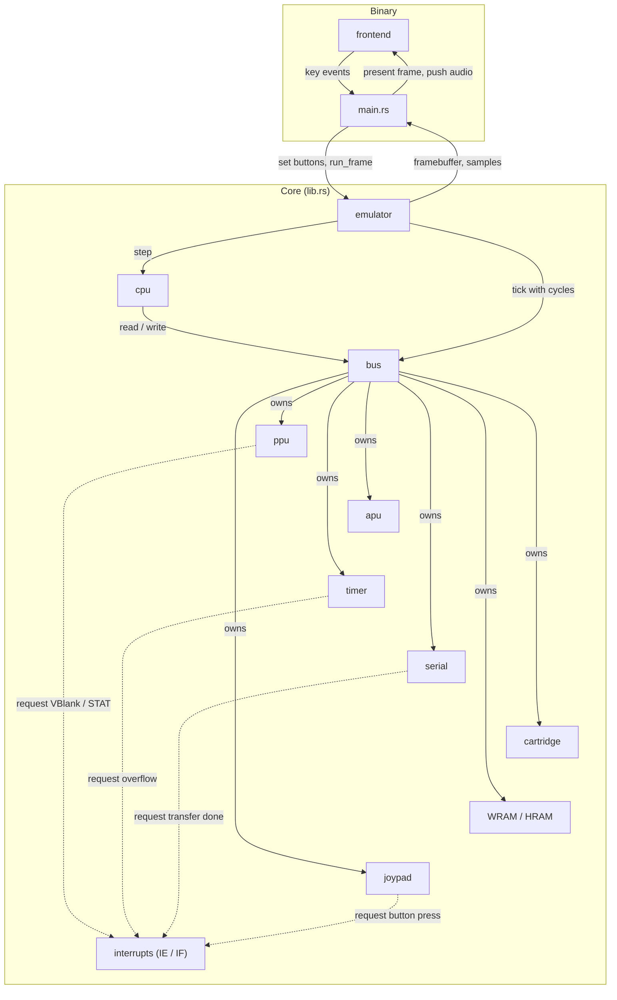

<div align="center">

# GameBoy Emulator in Rust


A Game Boy (DMG) emulator written from scratch in Rust — built as a deep dive
into low-level systems programming, hardware emulation, and computer architecture.

</div>

---

## Getting Started

### Prerequisites

- [Rust](https://www.rust-lang.org/tools/install) ≥ 1.85 (edition 2024)
- [SDL2](https://www.libsdl.org/) (rendering and audio, required from M5)
  - Debian/Ubuntu: `sudo apt install libsdl2-dev`
  - macOS: `brew install sdl2`
  - Nix: provided by the dev shell (see below)

### Build & Run

```bash
git clone https://github.com/EnzoSergiani/Gaboemru.git
cd Gaboemru

cargo test
cargo run --release -- path/to/rom.gb
```

> The ROM header is parsed from M1; the display window arrives with M5.

### Using Nix (optional)

With flakes enabled:

```bash
nix develop
```

The shell provides `rustc` (latest stable), `rust-analyzer`, `clippy`, `rustfmt`,
`cargo-watch`, `cargo-expand` and `cargo-audit`.

---

## Testing

Test ROMs and test data are **not stored in this repository** (each suite has its
own licence). They are expected in `tests/roms/` (git-ignored); a fetch script is
planned in M0.

| Suite                                                              | Used for                                                                           | Milestones |
| ------------------------------------------------------------------ | ---------------------------------------------------------------------------------- | ---------- |
| [SingleStepTests/sm83](https://github.com/SingleStepTests/sm83)    | CPU: one JSON file per opcode (initial state, final state, bus activity per cycle) | M2, M8     |
| [Mooneye test suite](https://github.com/Gekkio/mooneye-test-suite) | Hardware behaviour: interrupts, timer, PPU, DMA, mappers                           | M3–M8      |
| [dmg-acid2](https://github.com/mattcurrie/dmg-acid2)               | PPU rendering, compared to a reference image                                       | M4         |
| Blargg `dmg_sound`                                                 | APU only (the only remaining use of Blargg's ROMs)                                 | M7         |

Prebuilt ROMs for these suites are available in
[game-boy-test-roms](https://github.com/c-sp/game-boy-test-roms).

A Mooneye ROM signals success by executing `LD B,B` with registers
`B, C, D, E, H, L` = `3, 5, 8, 13, 21, 34`. Many Mooneye tests check cycle-exact
timing, so `tests/mooneye_allowlist.txt` lists the ROMs expected to pass. It grows
with each milestone, and CI fails on any regression.

---

## Roadmap

Development is organised in milestones. Each one ends with a **measurable exit
criterion** (an automated test) and is tagged with a version (`v0.x.0`) when
reached. Status: ✅ done · 🚧 in progress · ⬜ planned.

| Milestone               | Version | Scope                                   | Exit criterion                                                 | Status |
| ----------------------- | ------- | --------------------------------------- | -------------------------------------------------------------- | :----: |
| M0 — Foundations        | v0.0.0  | Tooling, CI, logging, lib/bin split     | CI green on `main`                                             |   ✅   |
| M1 — Cartridge & Bus    | v0.1.0  | ROM loading, header, memory map         | Header of a test ROM parsed                                    |   ✅   |
| M2 — CPU                | v0.2.0  | Full instruction set, cycle counts      | All SingleStepTests/sm83 opcode files pass                     |   ✅   |
| M3 — Interrupts & Timer | v0.3.0  | IME/IE/IF, timer, HALT, serial          | Unit/integration tests pass; Mooneye validation deferred to M4 |   ✅   |
| M4 — PPU                | v0.4.0  | LCD modes, BG, window, sprites, OAM DMA | `dmg-acid2` pixel-identical                                    |   🚧   |
| M5 — Frontend & Input   | v0.5.0  | SDL2 window, joypad, frame pacing       | Tetris playable                                                |   ⬜   |
| M6 — Cartridge mappers  | v0.6.0  | MBC1, MBC3 (RTC), MBC5, saves           | Mooneye MBC tests pass, saves survive a restart                |   ⬜   |
| M7 — APU                | v0.7.0  | 4 sound channels, resampling            | `dmg_sound`                                                    |   ⬜   |
| M8 — Accuracy           | v0.8.0  | M-cycle accurate bus                    | Per-cycle SingleStepTests + full Mooneye DMG acceptance        |   ⬜   |

<details>
<summary><b>M0 — Foundations</b></summary>

- [x] Project setup, Nix dev shell
- [x] Logging with `tracing` (`logs/emulator.log`, overwritten on each run)
- [x] Library (`lib.rs`, emulation core) / binary (`main.rs`, glue) split
- [x] CI: `cargo fmt --check`, `cargo clippy -- -D warnings`, `cargo test`
- [x] Test ROM fetch script; `logs/`, `target/` and `tests/roms/` git-ignored
- [x] `CHANGELOG.md` ([Keep a Changelog](https://keepachangelog.com/) format)

**Exit criterion**: CI passes on `main`.
</details>

<details>
<summary><b>M1 — Cartridge & Bus</b></summary>

- [x] ROM path as command-line argument
- [x] Parse the header (title, cartridge type, ROM/RAM size)
- [x] Verify the header checksum (`0x014D`)
- [x] `Mbc` trait with a ROM-only implementation
- [x] `Bus` struct with full address decoding (ROM/RAM cartridge, VRAM, WRAM, echo RAM, OAM, unusable area, I/O, HRAM, IE)
- [x] Unit tests for address decoding

**Exit criterion**: header of a test ROM is parsed by an automated test.
</details>

<details>
<summary><b>M2 — CPU</b></summary>

- [x] Registers, 16-bit pairs (`AF`, `BC`, `DE`, `HL`) and flags (`Z`, `N`, `H`, `C`)
- [x] Post-boot state (`A=01 F=B0 BC=0013 DE=00D8 HL=014D SP=FFFE PC=0100`)
- [x] Fetch / decode / execute loop, generic over the `Bus` trait
- [x] 245 valid base opcodes (256 minus 11 illegal; `0xCB` is the prefix)
- [x] 256 `0xCB`-prefixed opcodes
- [x] Cycle counting (including conditional branches)
- [x] SingleStepTests/sm83 JSON runner
- [x] Optional instruction trace via `tracing`
- [x] `Bus` trait abstraction, with a flat 64 KiB RAM test double for SingleStepTests

**Exit criterion**: all SingleStepTests/sm83 opcode files pass.
</details>

<details>
<summary><b>M3 — Interrupts & Timer</b></summary>

- [x] `IME`, `IE` (`0xFFFF`), `IF` (`0xFF0F`)
- [x] Interrupt dispatch and vectors (`0x40`, `0x48`, `0x50`, `0x58`, `0x60`)
- [x] `EI` delay, `HALT` and the HALT bug
- [x] Timer: `DIV`, `TIMA`, `TMA`, `TAC` and overflow interrupt
- [x] Serial port (`SB` / `SC`) and its interrupt
- [x] `Cpu` wired into `GameBoy` (owns and steps it each loop iteration)
- [x] Headless Mooneye ROM runner (`LD B,B` success protocol, cycle timeout, `tests/mooneye_allowlist.txt`)

**Exit criterion**: unit and integration tests cover IME/IE/IF dispatch, HALT (including the HALT bug), the timer and serial peripherals; the headless Mooneye runner exists and will be validated against real ROMs starting M4, once a PPU is implemented.
</details>

<details>
<summary><b>M4 — PPU</b></summary>

- [ ] LCD registers (`LCDC`, `STAT`, `LY`, `LYC`, `SCX`, `SCY`, `WX`, `WY`, `BGP`, `OBP0/1`)
- [ ] Modes (OAM scan, drawing, HBlank, VBlank), 456 cycles per line, 70 224 per frame
- [ ] Background and window rendering
- [ ] Sprites (8×8 / 8×16, priority, flipping, 10 per line)
- [ ] OAM DMA
- [ ] `VBlank` and `STAT` interrupts
- [ ] Framebuffer 160×144 (4 shades), dumpable to PNG for tests

**Exit criterion**: `dmg-acid2` output identical to its reference image.
</details>

<details>
<summary><b>M5 — Frontend & Input</b></summary>

- [ ] SDL2 window displaying the framebuffer (scaled), behind a `frontend` feature
- [ ] Joypad register (`0xFF00`), joypad interrupt, keyboard mapping
- [ ] Frame pacing at ~59.73 Hz

**Exit criterion**: Tetris (ROM-only cartridge) is playable.
</details>

<details>
<summary><b>M6 — Cartridge mappers</b></summary>

- [ ] MBC1 (ROM/RAM banking)
- [ ] MBC3 (with real-time clock)
- [ ] MBC5
- [ ] Battery-backed saves (`.sav`)

**Exit criterion**: Mooneye MBC tests pass; one game per mapper boots and its save survives a restart.
</details>

<details>
<summary><b>M7 — APU</b></summary>

- [ ] Channels 1–2 (pulse, sweep on channel 1), channel 3 (wave), channel 4 (noise)
- [ ] Frame sequencer (length, envelope, sweep)
- [ ] Resampling and audio/video synchronisation

**Exit criterion**: `dmg_sound` passes.
</details>

<details>
<summary><b>M8 — Accuracy</b></summary>

- [ ] Bus that advances components on every memory access (M-cycle)
- [ ] SingleStepTests checked cycle by cycle (bus activity)
- [ ] Full Mooneye DMG acceptance suite, except tests depending on boot ROM timing

**Exit criterion**: the allowlist covers the whole DMG acceptance suite (minus boot-ROM tests).
</details>

### Backlog (unscheduled)

Built-in debugger · Save states · Boot ROM support (unlocks boot-dependent Mooneye tests) · Game Boy Color · WebAssembly build

### Definition of Done (all milestones)

- `cargo fmt`, `cargo clippy -- -D warnings` and `cargo test` pass in CI
- The exit criterion is automated as a test whenever possible
- README and `CHANGELOG.md` updated, then the version is tagged

---

## Architecture

### Current structure

```
src/
├── bus/
├── cartridge/
├── cpu/
├── common/
├── emulator/
├── serial/
├── timer/
├── lib.rs
└── main.rs
```

### Planned structure

```
src/
├── apu/           # Audio Processing Unit
├── bus/           # Memory bus, address decoding, WRAM/HRAM
├── cartridge/     # ROM loading and MBC handling
├── common/        # Shared types, constants and utilities
├── cpu/           # Registers, instruction set, IME handling
├── emulator/      # Owns CPU + Bus, exposes run_frame()
├── frontend/      # SDL2 window, input, audio output
├── interrupts/    # IE / IF registers
├── joypad/        # Joypad register
├── ppu/           # LCD modes and rendering
├── serial/        # Serial port (SB / SC)
├── timer/         # DIV / TIMA / TMA / TAC
├── lib.rs         # Emulation core (no I/O, no SDL2)
└── main.rs        # Glue between core and frontend
```

### Component interaction (instruction-level stepping, M1–M7)

The core never depends on the frontend. `main.rs` moves data between them:
input goes in, framebuffer and audio samples come out. From M8, components
advance on every bus access instead of after each instruction.
`common` is used by every core module and is omitted from the diagram.



The CPU reads `IF` and `IE` through the bus, because they are memory-mapped
registers (`0xFF0F` and `0xFFFF`). It holds `IME` itself and decides on dispatch.

---

## Debugging

Logs are written to `logs/emulator.log` and **overwritten on each run**.
The verbosity is set in `main.rs` (`LevelFilter`).

---

## References & Resources

| Resource                                                                                 | Description                                                    |
| ---------------------------------------------------------------------------------------- | -------------------------------------------------------------- |
| [The Rust Book](https://doc.rust-lang.org/book/)                                         | Official Rust documentation                                    |
| [Awesome Game Boy Development](https://gbdev.io/resources.html)                          | Curated list of Game Boy development resources, tools and docs |
| [Pan Docs](https://gbdev.io/pandocs/)                                                    | The most comprehensive Game Boy hardware reference             |
| [Game Boy: Complete Technical Reference](https://gekkio.fi/files/gb-docs/gbctr.pdf)      | Detailed technical reference by Gekkio                         |
| [Game Boy opcode tables](https://gbdev.io/gb-opcodes/optables/)                          | Opcode tables and instruction details                          |
| [RGBDS instruction reference](https://rgbds.gbdev.io/docs/)                              | Instruction descriptions and timing information                |
| [Game Boy Architecture](https://www.copetti.org/writings/consoles/game-boy/)             | In-depth look at the Game Boy architecture                     |
| [DMG-01: How to Emulate a Game Boy](https://rylev.github.io/DMG-01/public/book/)         | Emulator book in Rust, by Rylev                                |
| [An Introduction to Game Boy Emulation](https://aquova.net/emudev/gb/)                   | Emulator tutorial in Rust, by Aquova                           |
| [Building a Game Boy Emulator in Rust](https://sogood99.github.io/posts/gameboy_rust_0/) | Step-by-step guide, by Mani                                    |
| [SingleStepTests/sm83](https://github.com/SingleStepTests/sm83)                          | Per-opcode CPU tests with cycle-level bus activity             |
| [Mooneye test suite](https://github.com/Gekkio/mooneye-test-suite)                       | High-precision hardware test ROMs                              |
| [game-boy-test-roms](https://github.com/c-sp/game-boy-test-roms)                         | Prebuilt collection of test ROMs                               |

---

## Disclaimer

This project is developed **strictly for educational purposes** — to learn systems programming, computer architecture, and emulation techniques through Rust.

- This project does **not** distribute, encourage, or facilitate access to copyrighted ROMs or commercial game software.
- Users are responsible for complying with the laws of their jurisdiction regarding ROM usage.
- Game Boy is a trademark of Nintendo. This project is not affiliated with Nintendo.

---

## License

This project is licensed under the **MIT License** — see the [LICENSE](LICENSE) file for details.
